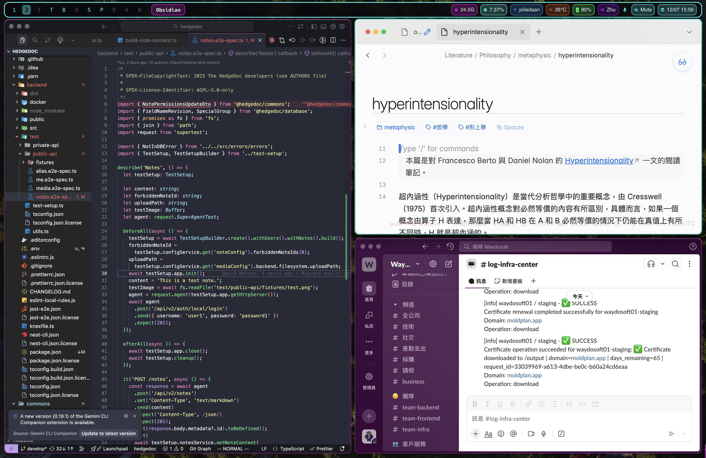

# macOS Dotfiles - Cyberpunk Edition

[繁體中文](README.zh-TW.md)

My personal macOS configuration files for a cyberpunk-themed desktop environment.

## Components

- **[AeroSpace](https://github.com/nikitabobko/AeroSpace)** - Tiling window manager
- **[SketchyBar](https://github.com/FelixKratz/SketchyBar)** - Custom menu bar
- **[JankyBorders](https://github.com/FelixKratz/JankyBorders)** - Window borders
- **[WezTerm](https://wezfurlong.org/wezterm/)** - Terminal with tmux-like leader keybindings and persistent sessions via unix-domain mux
- **[tmux](https://github.com/tmux/tmux)** - Multiplexer mirroring the WezTerm leader keymap; ships with a `bin/zed-tmux` wrapper that gives each Zed project its own persistent session

## Screenshots



## Quick Install

```bash
git clone https://github.com/wayne930242/dotfiles-macos.git ~/dotfiles-macos
cd ~/dotfiles-macos
./install.sh
```

The install script will:
1. Install Homebrew (if not present)
2. Install AeroSpace, SketchyBar, JankyBorders, and dependencies
3. Backup your existing configs to `~/.dotfiles-backup/`
4. Create symlinks to the dotfiles
5. Start all services

### Other Commands

```bash
./install.sh install    # Install (default)
./install.sh uninstall  # Remove symlinks and stop services
./install.sh restore    # Restore from a previous backup
./install.sh help       # Show help
```

## Manual Installation

### Prerequisites

```bash
brew install --cask nikitabobko/tap/aerospace
brew tap FelixKratz/formulae
brew install sketchybar
brew install borders
brew install nowplaying-cli  # For media widget
brew install --cask wezterm
brew install tmux
```

### Setup

```bash
# Clone this repo
git clone https://github.com/wayne930242/dotfiles-macos.git ~/dotfiles-macos

# Symlink configurations
ln -sf ~/dotfiles-macos/sketchybar ~/.config/sketchybar
ln -sf ~/dotfiles-macos/borders ~/.config/borders
ln -sf ~/dotfiles-macos/.aerospace.toml ~/.aerospace.toml
ln -sf ~/dotfiles-macos/.wezterm.lua ~/.wezterm.lua
ln -sf ~/dotfiles-macos/.tmux.conf ~/.tmux.conf

# Start services
brew services start sketchybar
brew services start borders
```

## Zed Integration

The `bin/zed-tmux` wrapper makes Zed's terminal panel attach to a per-project tmux session named `zed-<project-basename>`, so each Zed project keeps its own persistent shell state across restarts.

Add to `~/.config/zed/settings.json`:

```jsonc
"terminal": {
  "shell": {
    "with_arguments": {
      "program": "/Users/<you>/dotfiles-macos/bin/zed-tmux",
      "args": []
    }
  }
}
```

## Workspaces

| Key | Workspace | Purpose |
|-----|-----------|---------|
| `alt-1` ~ `alt-5` | 1–5 | General use |
| `alt-w` | W | Terminal (WezTerm) |
| `alt-c` | C | Browser (Chrome / Comet) |
| `alt-g` | G | Game / Chill |
| `alt-s` | S | Social (Discord, Slack, Telegram) |
| `alt-q` | Q | Project (Linear + Slack) |
| `alt-d` | D | Docker |
| `alt-a` | A | AI / Agents |
| `alt-z` | Z | Obsidian (Notes) |
| `alt-x` | X | Xcode |

## SketchyBar Widgets

**Left:** Workspaces | Front App | Git Branch

**Right:** Calendar | Volume/Mic | Input | Battery | Weather | Network | Media | CPU | Memory

## Theme

Cyberpunk color palette:
- Primary: `#00fff7` (Neon Cyan)
- Secondary: `#ff00ff` (Magenta)
- Accent: `#ff6600` (Orange)
- Background: `#0a0a0f` (Dark)

## License

MIT
