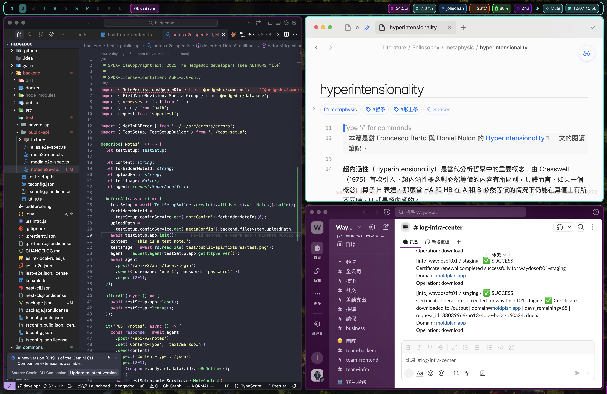

# macOS Dotfiles - 賽博龐克風格

個人 macOS 設定檔，打造賽博龐克風格的桌面環境。

## 元件

- **[AeroSpace](https://github.com/nikitabobko/AeroSpace)** - 平鋪式視窗管理器
- **[SketchyBar](https://github.com/FelixKratz/SketchyBar)** - 自訂選單列
- **[JankyBorders](https://github.com/FelixKratz/JankyBorders)** - 視窗邊框

## 截圖



## 快速安裝

```bash
git clone https://github.com/wayne930242/dotfiles-macos.git ~/dotfiles-macos
cd ~/dotfiles-macos
./install.sh
```

安裝腳本會自動：
1. 安裝 Homebrew（如未安裝）
2. 安裝 AeroSpace、SketchyBar、JankyBorders 及相依套件
3. 備份現有設定至 `~/.dotfiles-backup/`
4. 建立 symlinks
5. 啟動所有服務

### 其他指令

```bash
./install.sh install    # 安裝（預設）
./install.sh uninstall  # 移除 symlinks 並停止服務
./install.sh restore    # 從備份還原
./install.sh help       # 顯示說明
```

## 手動安裝

### 前置需求

```bash
brew install --cask nikitabobko/tap/aerospace
brew tap FelixKratz/formulae
brew install sketchybar
brew install borders
brew install nowplaying-cli  # 媒體小工具需要
```

### 設定

```bash
# 複製此專案
git clone https://github.com/wayne930242/dotfiles-macos.git ~/dotfiles-macos

# 建立 symlinks
ln -sf ~/dotfiles-macos/sketchybar ~/.config/sketchybar
ln -sf ~/dotfiles-macos/borders ~/.config/borders
ln -sf ~/dotfiles-macos/.aerospace.toml ~/.aerospace.toml

# 啟動服務
brew services start sketchybar
brew services start borders
```

## 工作區

| 快捷鍵 | 工作區 | 用途 |
|--------|--------|------|
| `alt-1/2/3` | 1, 2, 3 | 一般使用 |
| `alt-t` | T | 終端機 (WezTerm) |
| `alt-b` | B | 瀏覽器 |
| `alt-g` | G | 遊戲/休閒 |
| `alt-s` | S | 社交 (Discord, Slack, Telegram) |
| `alt-p` | P | Linear (專案管理) |
| `alt-d` | D | Docker |
| `alt-a` | A | AI/Agents |
| `alt-n` | N | Obsidian (筆記) |

## SketchyBar 小工具

**左側：** 工作區 | 前景 App | Git 分支

**右側：** 日曆 | 音量/麥克風 | 輸入法 | 電池 | 天氣 | 網路 | 媒體 | CPU | 記憶體

## 主題配色

賽博龐克色票：
- 主色：`#00fff7` (霓虹青)
- 副色：`#ff00ff` (洋紅)
- 強調色：`#ff6600` (橘色)
- 背景：`#0a0a0f` (深色)

## 授權

MIT
